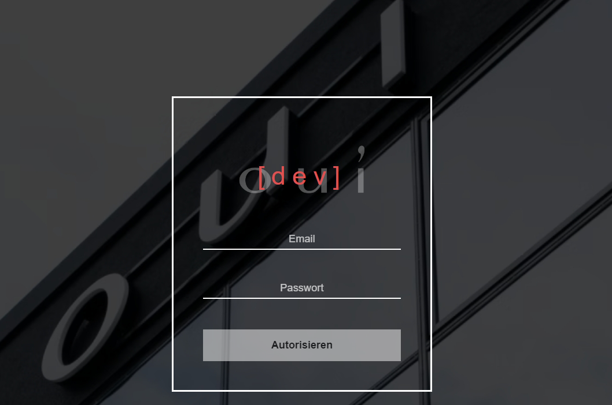
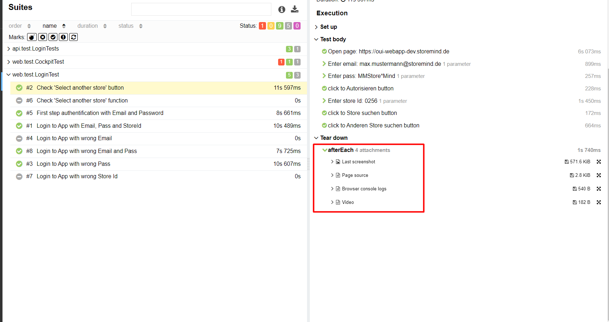

<h2 align="center"> Testing automation project for OUI company</h2>
<p  align="center">
<a href="https://oui-webapp-dev.storemind.de/"></a>
</p>

# <a name="Content">Content</a>

+ [Description](#Description)
+ [Tools](#Tools)
+ [Launch Options](#Launch-Options)
    + [gradle commands](#Gradle-commands)
    + [Launch in Jenkins](#Launch-in-jenkins)
+ [Slack notifications](#Slack-notifications)
+ [Allure Report](#Allure-Report)
+ [Video of the test run](#Video-test-run)

# <a name="Description">Description</a>
## Development lifecycle


The test project consists of web tests (UI), API tests.\
A short list of the test approach used in the development of the project:

- [x] Java 11 required
- [x] <a href="https://www.selenium.dev/documentation/test_practices/encouraged/page_object_models/">`Page Object`
  design pattern</a>
- [x] Parameterized tests
- [x] [Java faked for creating test data](https://github.com/DiUS/java-faker)
- [x] [Configuration with the library `Owner`](https://matteobaccan.github.io/owner/)
- [x] [`Lombok` used for models in API tests](https://projectlombok.org/)
- [x] Using request/response specifications for API tests
- [x] [Allure report for generating reports](https://allurereport.org/)
- [x] Custom Allure listener for API requests/responses logs
- [x] Autotests as test documentation
- [x] Sending notifications about failed tests to Slack

# <a name="Tools">Tools</a>

<p  align="center">
  <code></code>
  <code></code>
  <code></code>
  <code></code>
  <code></code>
  <code></code>
  <code></code>
  <code></code>
  <code></code>
  <code></code>
  <code></code>
  <code></code>
  <code></code>
</p>

The autotests in this project are written in `Java` using the `Selenide` framework.\
`Java 11` required\
`Selenide` is framework for Selenium WebDriver, which allows to quickly and easily use it when writing tests, paying
special attention to logic rather than configuration settings\
`Gradle` - It is used as an assembly automation tool.  \
`JUnit5` - a platform for executing tests.\
`REST Assured` - for testing REST API services.\
`Jenkins` - CI/CD for running tests remotely. an open source automation server which enables developers around the world
to reliably build, test, and deploy their software.\
`Selenoid` - is a powerful implementation of Selenium hub using `Docker` containers to launch browsers.\
`Browserstack` - an alternative for running tests(Selenoid+Docker)\
`Allure Report` - to visualize the test results.\
`Slack Bot` - for notifications about test results.\

[Go back to top ⬆](#Content)

# <a name="Launch-Options">Launch Options</a>

## <a name="Gradle-commands">Gradle commands</a>

The following command is used to run locally and in Jenkins::

```bash
gradle clean test -Dtag=<tag>
```

Additional parameters:
> - `-Dbrowser=<chrome>` - selecting the browser on which the tests will be run
>- `-Dbrowser.size=<1520x980>`
>- `-Dapp.store_id=<0249>`
>- `-Dremote=<false>` - to run tests locally without using Selenoid+Docker

`tag` - tags for launching test execution:
> - *login*
>- *api*
>- *cockpit*
>- *ui*
>- *smoke*

Combination:


[Go back to top ⬆](#Content)

## <a name="Launch-in-jenkins">Launch in jenkins</a>

The main page of the ci/cd:
<p  align="center">

</p>

A parameterized Jenkins job can be run with the necessary ***tag*** and ***browser***:
<p  align="center">

</p>

After the run is completed, the test results are available in:
> - <code><strong>*Allure Report*</strong></code>

[Go back to top ⬆](#Content)

# <a name="Slack-notifications">Slack notifications</a>

The Slack bot sends a short report to the specified Slack chanel based on the results of failed build.
<p  align="center">

</p>

[Go back to top ⬆](#Content)

# <a name="Allure-Report">Allure Report</a>

## Main page

The main page of the Allure report contains the following blocks:

> - <code><strong>*ALLURE REPORT*</strong></code> - displays the date and time of the test, the total number of running
    tests, as well as a chart with the percentage and number of successful, dropped and broken tests during execution
>- <code><strong>*TREND*</strong></code> - displays the test execution trend for all runs
>- <code><strong>*SUITES*</strong></code> - displays the distribution of tests by suite
>- <code><strong>*CATEGORIES*</strong></code> - displays the distribution of failed tests by defect type
<p align="center">
  
</p>

## A list of tests with steps and test artifacts

On the page there is a list of tests grouped by sets, indicating the status for each test.\
Full information about each test can be shown: tags, duration, detailed steps.

<p align="center">
  
</p>

Additional test artifacts are also available:
> - Last screenshot
>- Page Source
>- Browser console logs
>- Video

<p align="left">
  
</p>

[Go back to top ⬆](#Content)


# <a name="Video-test-run">Video of the test run</a>

<p align="center">
  
</p>

[Go back to top ⬆](#Content)
